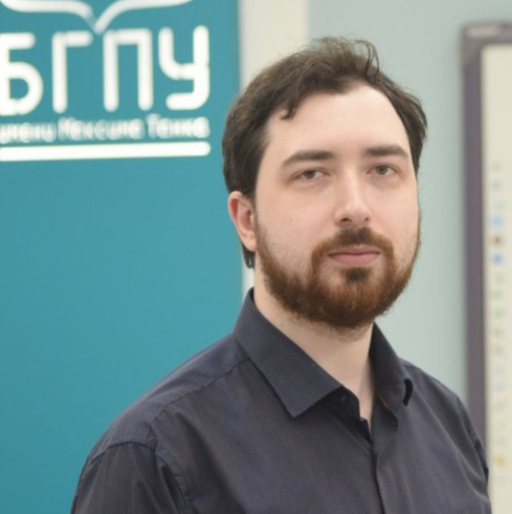
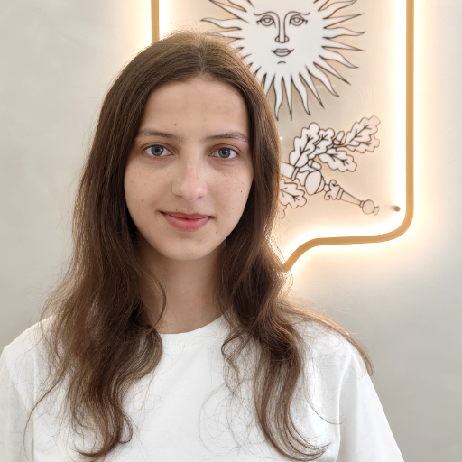
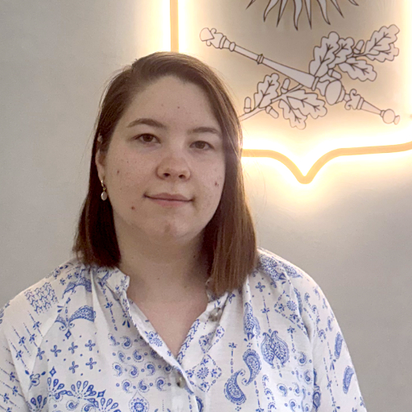
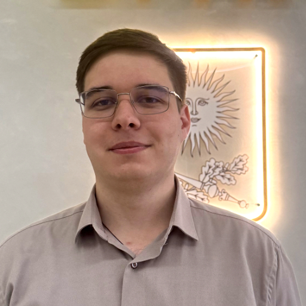
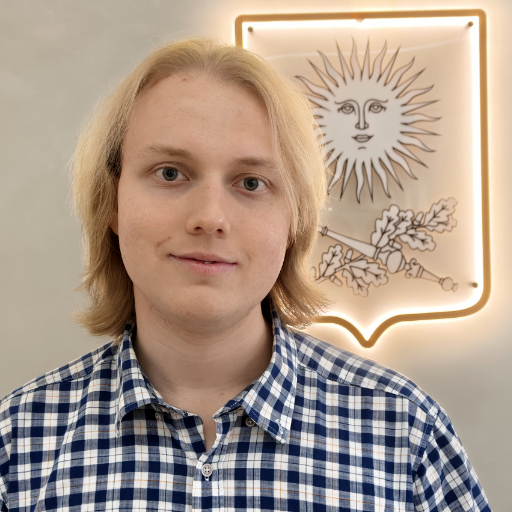
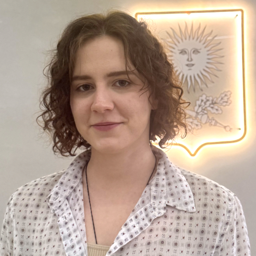

Дадатак дапамагае ацаніць Scratch-праект і знайсці памылкі ў скрыптах.

::::div{.devs__container}

:::div{.devs__card}

**Павел Аляксандравіч Харошэвіч** старшы выкладчык кафедры інфарматыкі і метадыкі выкладання інфарматыкі фізіка-матэматычнага факультэта БДПУ імя Максіма Танка. Распрацаваў сістэму праверкі і ацэньвання праектаў.

:::

:::div{.devs__card}

**Анна Багамолава** студэнтка фізіка-матэматычнага факультэта БДПУ імя Максіма Танка. Складала сістэмны запыт для чат-бота з правіламі візуалізацыі рашэння задачы з дапамогай :a[mermaidjs-диаграмм]{href="https://github.com/mermaid-js/mermaid" target="_blank"}.

:::

:::div{.devs__card}

**Таццяна Занько** студэнтка фізіка-матэматычнага факультэта БДПУ імя Максіма Танка. Займалася ўводнай часткай сістэмнага запыту з апісаннем ролі, задач і абмежаванняў чат-бота.

:::

:::div{.devs__card}

**Мікалай Макавец** студэнт фізіка-матэматычнага факультэта БДПУ імя Максіма Танка. Складаў сістэмны запыт для чат-бота, які адказвае за візуалізацыю Scratch-скрыптаў з дапамогай мовы разметкі :a[scratchblocks]{href="https://github.com/scratchblocks/scratchblocks" target="_blank"}.

:::

:::div{.devs__card}

**Нікіта Панкратаў** студэнт фізіка-матэматычнага факультэта БДПУ імя Максіма Танка. Прапісваў у сістэмным запыце чат-бота кампанент для арганізацыі рэфлексіі вучня.

:::

:::div{.devs__card}

**Марыя Славецкая** студэнтка фізіка-матэматычнага факультэта БДПУ імя Максіма Танка. Займалася сістэмным запытам для чат-бота, які адказвае за вядзенне Сакратычнага дыялога і Scaffolding (паступовае змяншэнне колькасці падказак).

:::

::::

Падрабязней пра праект можна пачытаць у :a[блогу]{href="https://cs-labs.netlify.app/blog/posts/2023/08/kotfix/" target="_blank"}. Зыходны код праекта размешчаны на :a[старонцы ў GitHub]{href="https://github.com/skyfroger/catfix" target="_blank"}.
