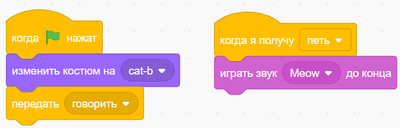

На странице перечислены ошибки, которые КотФикс может найти в вашем проекта. Подробно рассказано о замечаниях, показаны примеры кода.

## Содержание

## Ошибки

### Сообщение никто не получает

Ошибка возникает, когда скрипт отправляет сообщение, которое не получает ни один из скриптов. Возможно вы забыли добавить получение этого сообщения, или выбрали получение другого сообщения.

В следующем примере спрайт отправляет сообщение **говорить**, а другой скрипт принимает сообщение **петь**. Команды в последнем скрипте не будут выполняться.

#### Как исправить?

Нужно убедиться, что в блоках-триггерах **когда я получу ...** выбрано правильное имя сообщения.

### Неотправленное сообщение

### Переменная без начального значения

### Сравнение буквальных значений

## Замечания

### Пустой спрайт

### Неиспользуемая переменная

### Потерянный код

### Нет комментариев

### Наложение скриптов

### Слишком длинный скрипт

### Стандартное имя спрайта
